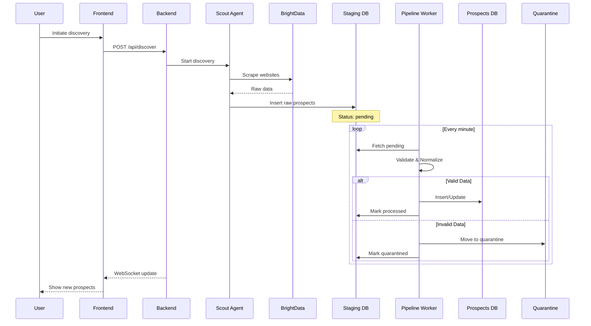
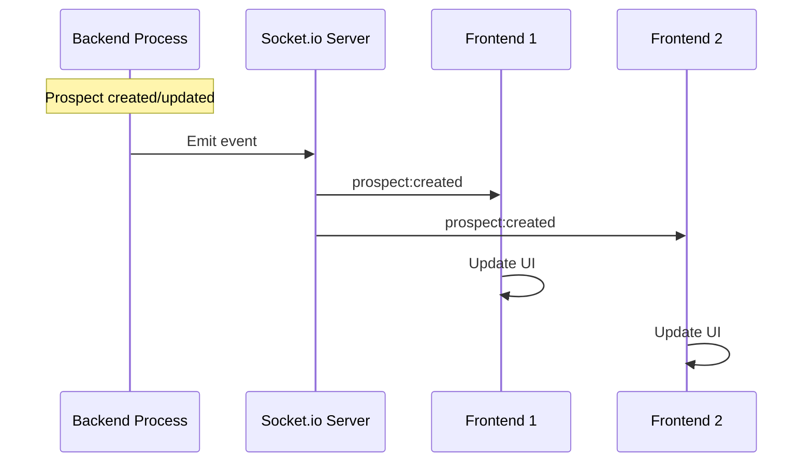
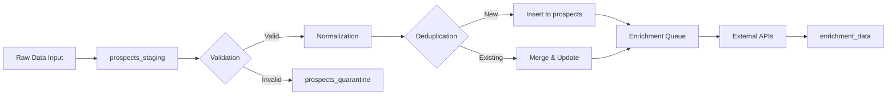
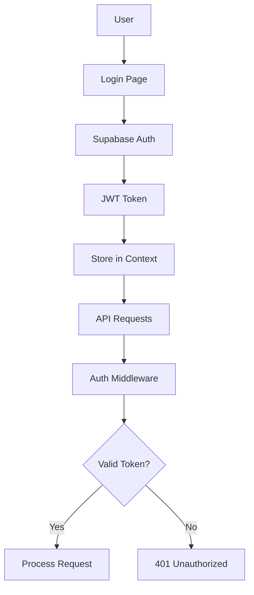
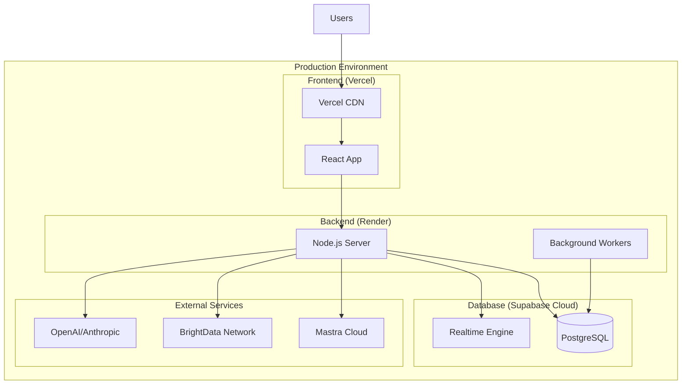

# Artemis Architecture Diagram

## System Overview

```mermaid
graph TB
    subgraph "Frontend (React + Vite)"
        UI[React UI Components]
        Auth[Auth Context]
        API[API Service Layer]
        WS[WebSocket Service]
        
        UI --> Auth
        UI --> API
        UI --> WS
    end
    
    subgraph "Backend (Node.js + Express)"
        Server[Express Server]
        MW[Middleware Layer]
        Routes[API Routes]
        WSServer[Socket.io Server]
        
        subgraph "Services"
            Supabase[Supabase Service]
            Arcade[Arcade AI Service]
            BrightData[BrightData Service]
            LlamaIndex[LlamaIndex Service]
            Pipeline[Pipeline Worker]
            Enrichment[Enrichment Worker]
        end
        
        subgraph "AI Agents (Mastra)"
            Scout[Scout Agent]
            Analyst[Analyst Agent]
            Strategist[Strategist Agent]
            Executor[Executor Agent]
        end
        
        Server --> MW
        MW --> Routes
        Server --> WSServer
        Routes --> Services
        Routes --> AI Agents
    end
    
    subgraph "Database (Supabase/PostgreSQL)"
        subgraph "Core Tables"
            Users[users]
            Workspaces[workspaces]
            Prospects[prospects]
            Campaigns[campaigns]
            Analytics[analytics_events]
        end
        
        subgraph "Pipeline Tables"
            Staging[prospects_staging]
            Quarantine[prospects_quarantine]
            Enrichment[enrichment_data]
        end
    end
    
    subgraph "External Services"
        Mastra[Mastra Framework]
        BrightDataAPI[BrightData API]
        EnrichmentAPIs[Enrichment APIs]
        LLMs[LLM Providers]
    end
    
    subgraph "Background Jobs"
        CronPipeline[Pipeline Cron (1 min)]
        CronEnrichment[Enrichment Cron (30 min)]
    end
    
    %% Frontend to Backend connections
    API -.->|REST API| Routes
    WS -.->|WebSocket| WSServer
    
    %% Backend to Database connections
    Supabase --> Core Tables
    Supabase --> Pipeline Tables
    Pipeline --> Staging
    Pipeline --> Prospects
    Pipeline --> Quarantine
    Enrichment --> Enrichment[enrichment_data]
    
    %% Backend to External Services
    Scout --> BrightDataAPI
    AI Agents --> Mastra
    LlamaIndex --> LLMs
    Enrichment --> EnrichmentAPIs
    
    %% Background Jobs
    CronPipeline --> Pipeline
    CronEnrichment --> Enrichment
    
    %% Data Flow
    BrightDataAPI -.->|Raw Data| Staging
    Staging -.->|Valid Data| Prospects
    Staging -.->|Invalid Data| Quarantine
```

## Detailed Component Architecture

### Frontend Architecture
```
frontend/
├── src/
│   ├── pages/              # Route components
│   │   ├── Dashboard.jsx
│   │   ├── Prospects.jsx
│   │   ├── Campaigns.jsx
│   │   ├── Analytics.jsx
│   │   └── auth/
│   │       ├── Login.jsx
│   │       └── Signup.jsx
│   ├── components/         # Reusable UI components
│   │   ├── Layout.jsx
│   │   ├── ProspectTable.jsx
│   │   ├── ProspectCard.jsx
│   │   └── ActivityFeed.jsx
│   ├── services/           # API & WebSocket clients
│   │   ├── api.js         # REST API wrapper
│   │   ├── auth.service.js
│   │   └── websocket.service.js
│   └── contexts/          # React contexts
│       └── AuthContext.jsx
```

### Backend Architecture
```
backend/
├── src/
│   ├── server.js          # Main server entry
│   ├── routes/            # API endpoints
│   │   ├── auth.routes.js
│   │   ├── prospects.routes.js
│   │   ├── campaigns.routes.js
│   │   ├── analytics.routes.js
│   │   └── pipeline.routes.js
│   ├── services/          # Business logic
│   │   ├── supabase.service.js    # Database wrapper
│   │   ├── arcade.service.js      # AI orchestration
│   │   ├── brightdata.service.js  # Web scraping
│   │   ├── pipeline.worker.js     # ETL processing
│   │   ├── enrichment.worker.js   # Data enrichment
│   │   ├── validation.service.js  # Data validation
│   │   ├── normalization.service.js
│   │   └── deduplication.service.js
│   ├── agents/            # AI agents (Mastra)
│   │   ├── scout.agent.js
│   │   ├── analyst.agent.js
│   │   ├── strategist.agent.js
│   │   └── executor.agent.js
│   └── middleware/        # Express middleware
│       ├── auth.middleware.js
│       └── rateLimit.middleware.js
```

## Data Flow Sequences

### 1. Prospect Discovery Flow


### 2. Real-time Update Flow


### 3. Data Pipeline ETL Flow


## Security Architecture

### Authentication Flow


### Row Level Security (RLS)
```sql
-- Example RLS Policy
CREATE POLICY "Users can only see their workspace prospects"
ON prospects
FOR SELECT
USING (workspace_id = auth.workspace_id());
```

## Technology Stack Summary

| Layer | Technology | Purpose |
|-------|------------|---------|
| Frontend | React 18 + Vite | UI Framework |
| Styling | Tailwind CSS | Utility CSS |
| Charts | Recharts | Data Visualization |
| Backend | Node.js + Express | API Server |
| Real-time | Socket.io | WebSocket Communication |
| Database | Supabase (PostgreSQL) | Data Persistence |
| AI Orchestration | Mastra | Agent Workflow Management |
| Web Scraping | BrightData | Prospect Discovery |
| AI/LLM | LlamaIndex + Arcade | Intelligence Layer |
| Background Jobs | node-cron | Scheduled Tasks |
| Authentication | Supabase Auth | User Management |

## Deployment Architecture



## Key Architectural Decisions

1. **Microservices Pattern**: Services are modular and loosely coupled
2. **Event-Driven Updates**: WebSocket for real-time synchronization
3. **ETL Pipeline**: Staging tables for data quality control
4. **Agent Architecture**: Specialized AI agents for different tasks
5. **Security First**: RLS policies and JWT authentication
6. **Scalable Infrastructure**: Containerized deployment ready
